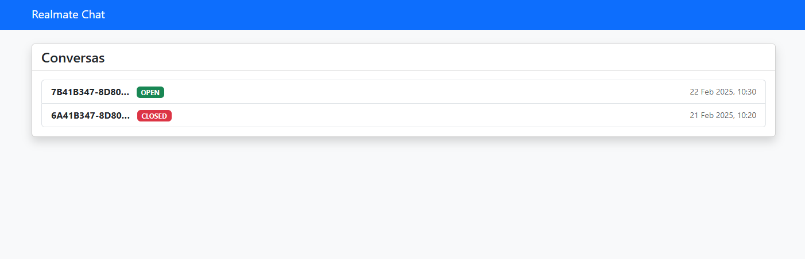
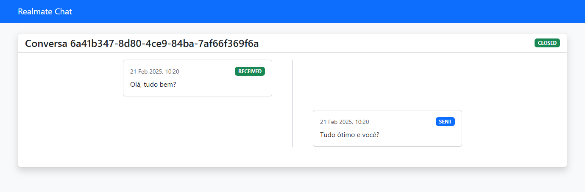

# Realmate Challenge 


*Interface web para visualização das conversas*


*Visão detalhada de uma conversa com histórico de mensagens*

## 🌐 Rotas Disponíveis

### Frontend
| Método | Rota                      | Descrição                           | Exemplo de Uso                          |
|--------|---------------------------|-------------------------------------|------------------------------------------|
| GET    | `/`                       | Lista todas as conversas            | `http://localhost:8000/`                 |
| GET    | `/conversations/{id}/`    | Exibe detalhes de uma conversa      | `http://localhost:8000/conversations/6a41b347-.../` |

### API
| Método | Rota                              | Descrição                           | Exemplo de Uso                          |
|--------|-----------------------------------|-------------------------------------|------------------------------------------|
| POST   | `/webhook/`                       | Recebe eventos de webhook           | `http://localhost:8000/webhook/`         |
| GET    | `/webhook/conversations/{id}/`    | Retorna dados JSON de uma conversa  | `http://localhost:8000/webhook/conversations/6a41b347-.../` |


## ✒️ Autor

<br>

<a href="https://github.com/gabriel61">

</a>

[](https://www.linkedin.com/in/sogabris/)
<br>
sogabris@gmail.com
<br>

## Introdução

O objetivo deste desafio é avaliar seus conhecimentos em **APIs** e **Webhooks**, além da sua capacidade de aprender rapidamente e implementar soluções eficientes, usando frameworks renomados como **Django** e **Django Rest Framework (DRF)**.

Você deverá desenvolver uma web API que sincroniza eventos de um sistema de atendimentos no WhatsApp, processando webhooks e registrando as alterações no banco de dados.

## 🎯 O Desafio

Desenvolver uma web API utilizando **Django Rest Framework** para receber webhooks de um sistema de atendimento. Esses webhooks contêm eventos relacionados a conversas e mensagens, e devem ser registrados no banco de dados corretamente.

## 📌 Requisitos

1.	Criar dois modelos principais:
	- `Conversation`
	- `Message` (relacionado a uma `Conversation`)
2.	A API deve:
	- Receber eventos via POST no endpoint `localhost/webhook/`
	- Criar instâncias dos modelos correspondentes
3.	Criar um endpoint GET em `localhost/conversations/{id}` para expor a conversa, incluindo:
	- Seu estado (`OPEN` ou `CLOSED`)
	- Suas mensagens
4.	Lidar com erros de maneira graceful (evitar retornos de erro 500).
5.	Restrições:
	- Uma `Conversation` deve ter um estado. Os estados possíveis são: `OPEN` e `CLOSED`
	- Uma `CLOSED` `Conversation` não pode receber novas mensagens
	- Uma `Message` deve ter dois tipos: `SENT` e `RECEIVED`
6.	O banco de dados utilizado deve ser SQLite.

## 📦 Formato dos Webhooks

Os eventos virão no seguinte formato:

### Novo evento de conversa iniciada

```json
{
    "type": "NEW_CONVERSATION",
    "timestamp": "2025-02-21T10:20:41.349308",
    "data": {
        "id": "6a41b347-8d80-4ce9-84ba-7af66f369f6a"
    }
}
```

### Novo evento de mensagem recebida

```json
{
    "type": "NEW_MESSAGE",
    "timestamp": "2025-02-21T10:20:42.349308",
    "data": {
        "id": "49108c71-4dca-4af3-9f32-61bc745926e2",
        "direction": "RECEIVED",
        "content": "Olá, tudo bem?",
        "conversation_id": "6a41b347-8d80-4ce9-84ba-7af66f369f6a"
    }
}
```

### Novo evento de mensagem enviada

```json
{
    "type": "NEW_MESSAGE",
    "timestamp": "2025-02-21T10:20:44.349308",
    "data": {
        "id": "16b63b04-60de-4257-b1a1-20a5154abc6d",
        "direction": "SENT",
        "content": "Tudo ótimo e você?",
        "conversation_id": "6a41b347-8d80-4ce9-84ba-7af66f369f6a"
    }
}
```

### Novo evento de conversa encerrada

```json
{
    "type": "CLOSE_CONVERSATION",
    "timestamp": "2025-02-21T10:20:45.349308",
    "data": {
        "id": "6a41b347-8d80-4ce9-84ba-7af66f369f6a"
    }
}
```

## 📌 Regras de Negócio

- Toda conversa começa no estado “OPEN”
- Uma conversa no estado “CLOSED” não pode receber novas mensagens
- As mensagens devem estar associadas a uma conversa existente
- O ID da mensagem e o ID da conversa devem ser únicos
- O sistema deve lidar com erros sem retornar HTTP 500

## 🔥 Bônus (Opcional)

Se quiser ir além e demonstrar sua capacidade de aprendizado e desenvolvimento rápido, você pode implementar um frontend simples para visualizar as conversas e mensagens.

## 🚀 Tecnologias e Ferramentas

- Django
- Django Rest Framework
- Poetry
- SQLite
- GitHub

## 📌 Instruções de Instalação

### Pré-requisitos

- Instalar o Poetry para gerenciamento de dependências:

```bash
pip install poetry
```

### Instalação do Projeto

> [!WARNING]  
> Siga todas as instruções de instalação do projeto. O descumprimento dos requisitos de instalação acarretará a desclassificação do(a) candidato(a).

1.	Crie um repositório público, utilizando este repositório como template. Para isso, clique sobre o botão "**Use this template**", no canto superio direito desta tela. Forks **não** serão aceitos.


2.	Instale as dependências do projeto utilizando o Poetry:

```bash
cd realmate-challenge
poetry install
```

3.	Aplique as migrações no banco de dados SQLite:

```bash
python manage.py migrate
```

4.	Execute o servidor de desenvolvimento:

```bash
python manage.py runserver
```


## 📌 Entrega e Requisitos

Após concluir o desafio, envie o link do repositório para o e-mail tecnologia@realmate.com.br com seu nome e número do WhatsApp informados no e-mail.

## 📚 Referências

- [Django Rest Framework](https://www.django-rest-framework.org/)
- [Django](https://www.djangoproject.com/)
- [Poetry](https://python-poetry.org/)

## 📧 Dúvidas

Caso tenha dúvidas sobre o desafio, entre em contato com nossa equipe de tecnologia no e-mail tecnologia@realmate.com.br.

Boa sorte! 🚀

_Equipe Realmate_
